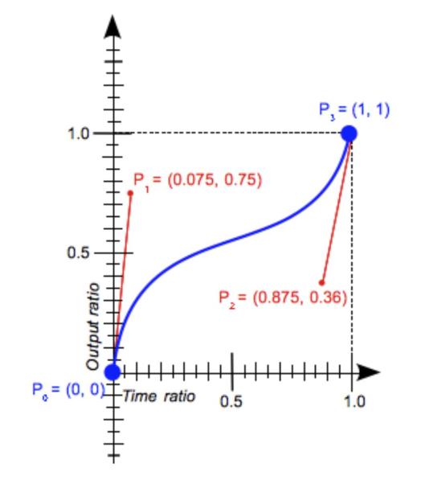

### 彻底弄懂timing-function

time-function是用来描述CSS3 animation动画曲线的函数，通常称之为缓动函数

```
div{
    animation: mv 3s ease;
}
```

这里的`ease`就是一个timing-function。那么ease真的就是函数吗？还可以定义其它的缓动过程吗？通常我们用到的动画都是连续的，那么有不连续的动画吗？这些问题都和time-function有关，接下来我们就来详细了解一下。

time-function实际只包含两个函数（类似ease这样的其实是表示某个取值的关键字），二者的本质区别在于动画是否是连续的

```
`cubic-bezier()`连续动画
`setps()`逐帧动画
```

**cubic-bezier()**

一条连续的贝赛尔曲线，由4个坐标点组成，P0、P1、P2和P3，横轴为时间比例，纵轴为完成状态。

[cubic-bezier.com](http://cubic-bezier.com/#.14,.95,.86,.15)

```
完成度
|   P1
|
|
|
|P0----------------时间
```

`P0`是起点，坐标为(0,0)表示初始时间和初始状态。

`P3`是终点，坐标为(1,1)表示终止时间和终止状态。

注意：P0和P3是曲线要经过的两个点。具体可以看下图，大家可以脑补一下



所以我们需要定义的就只有P1(x1,y1)和P2(x2,y2)，语法为

```
cubic-bezier(x1,y2,x2,y2)
```

实际开发中我们通常不会直接去使用这个函数，而是用一些该函数内置的关键字：

`linear`

```
cubic-bezier(0.0, 0.0, 1.0, 1.0)
```

`ease`

```
cubic-bezier(0.25, 0.1, 0.25, 1.0)
```

`ease-in`

```
cubic-bezier(0.42, 0.0, 1.0, 1.0)
```

`ease-in-out`

```
cubic-bezier(0.42, 0.0, 0.58, 1.0)
```

`ease-out`

```
cubic-bezier(0.0, 0.0, 0.58, 1.0)
```

**steps()**

和上面的连续动画不一样，由steps()定义出来的动画不是连续的，而是逐帧的。

语法为：

```
steps(number_of_steps, direction)
```

`number_of_steps`表示要将动画分割为几段。

比如

```
steps(2)
```

表示将动画分为2段。

`direction`表示动画是左连续还是右连续，这个参数不太好理解，但我们可以这样去记，它俩的区别在于动画开始于不同的帧。来看一个例子（假设动画时长为4s，元素位置为left:20px）

```
.ele{
    left: 20px;
    animation: mv 4s steps(2, end);
}
@keyframes mv{
    from {left: 0px;}
    to {left: 100px;}
}
```

那么实际上就是将动画过程分成了两段

```
0---50---100
```

**end**

>第一帧是第1步动画开始（默认值）

所以元素会依次出现在距左0px（停留2s）处和50px（停留2s）处，最后回到20px。

行程为：`0（开始-2s）-->50（2s-4s）-->100（忽略）-->20（4s之后）`。

**start**

>第一帧是第2步动画开始

所以元素会依次出现在距左50px（停留2s）处和100px（停留2s）处，最后回到20px。

行程为：`0（忽略）-->50（开始-2s）-->100（2s-4s）-->20（4s之后）`。

steps()也有两个关键字：

`step-start`

```
steps(1, start)
```

送花期间一直停留在结束状态：

`100（开始-4s）-->20（4s之后）`。

`step-end`

```
steps(1, end)
```

动画期间一直停留在初始状态：

`0（开始-4s）-->20（4s之后）`。