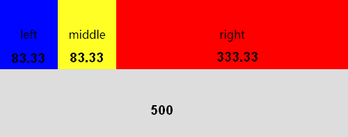
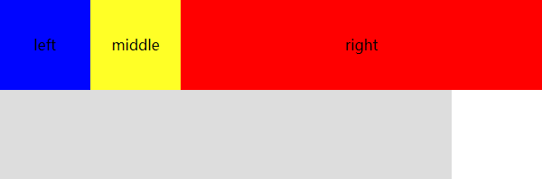

# flex 容器空间不足？

flex 布局已经逐渐成为了当下前端主流的布局方式了，我们来看一个简单的 flex 布局

```html
<div class="outer">
  <div class="left">left</div>
  <div class="middle">middle</div>
  <div class="right">right</div>
</div>
```

应用如下的 CSS（这里为了方便看重点，就省略了背景色之类的样式了）

```css
.outer {
  display: flex;
  width: 500px;
}
.left {
  width: 100px;
}
.middle {
  width: 100px;
}
.right {
  width: 400px;
}
```

这里会有一个问题，`.outer` 的总长度是 500，而里面 3 个元素的总长度之和为 `600`，但这里 outer 并不会被撑开，而是会反过来调整内部 3 个元素的长度，那么具体是怎么调整的呢？先看看结果



这里实际多出了 `100`，从上图可以看出，这 100 分摊到了 3 个元素上，实际上这里面是存在缩小比例和规则的。

拿 `left` 来说，其实我们要想知道其最终的宽度，就需要做下面的计算

```
100 - (100 * 缩小比例)
```

注意，这里的缩小比例是相对这多出的 100 px 而言的。那么这个缩小比例是怎么计算的呢？

在此之前我们需要先知道一个 flex 项的属性 `flex-shrink`，表示是在外部 flex 容器空间不足时，项目将缩小的权重（为了和缩小比例区分开），这是一个 `>= 0` 的整数，值越大则表示缩小得越大。默认为 `1`。

所以，要计算上面的缩小比例，实际上就是将每个项本身的宽度和权重相乘，然后计算这个值所占的比例。

```js
// 宽度 * 权重

let left = 100 * 1
let middle = 100 * 1
let right = 400 * 1
```

所以 left 的缩小比例就为

```js
let leftScalePercent = (100 * 1) / (100 * 1 + 100 * 1 + 400 * 1)
```

实际缩小宽度（px）就为

```js
let leftScale = 100 * leftSaclePercent
```

这里的 `100` 表示多出来的 100 像素。

所以计算 `left` 实际宽度的完整表达式如下

```js
100 -  100 * (100 * 1 / (100 * 1 + 100 * 1 + 400 * 1))
// 83.33333333333333
```

保留两位小数就得到了 left 的实际宽度 `83.33`。

同理，middle 也是一样的结果，right 的实际宽度则为

```js
400 -  100 * (400 * 1 / (100 * 1 + 100 * 1 + 400 * 1))
// 333.33333333333337
```

所以，每个元素缩小的比例不光受到 `flex-shrink` 权重值的影响，还会受到本身宽度的影响，其实细想一下不难理解，上面 3 个元素的 flex-shrink 值相同，很明显 right 的宽度更大，理应缩小得更多。

如果我们将 `flex-shrink` 修改一下会有什么结果呢？

```css
.left {
  flex-shrink: 5;
}
```

那么代入上面的公式， left 的实际宽度就变成了 `50`

```js
100 -  100 * (100 * 5 / (100 * 5 + 100 * 1 + 400 * 1))
// 50
```

同理，middle 变成了 `90`

```js
100 -  100 * (100 * 1 / (100 * 5 + 100 * 1 + 400 * 1))
// 90
```

right 变成了 `360`

```js
400 -  100 * (400 * 1 / (100 * 5 + 100 * 1 + 400 * 1))
// 360
```

如果我们将 left 的 flex-shrink 设为 `0`，则变成了

```js
100 -  100 * (100 * 0 / (100 * 0+ 100 * 1 + 400 * 1))

100 -  100 * (0 / 500)

100 - 0
```

所以，当 `flex-shrink` 为 `0` 时，表示该元素不被压缩，那么这超出的 `100` 就分摊到了 middle 和 right 上了。

那么有同学要问了，如果将这 3 个元素的 flex-shrink 都设置为 0，会是什么效果呢？答案是，这 3 个元素都保持了自身定义的宽度，于是就超出了 outer 外部容器了。

