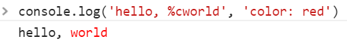
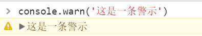
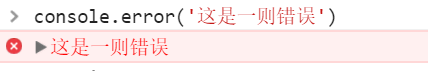
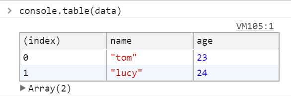
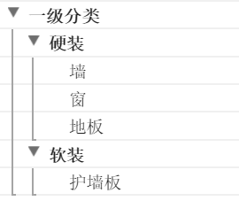

# console.log() 升级指南

`console.log()` 是每个前端开发者必用的调试方式，但大多数仍然是一个 `console.log()` 走遍天下，却不知道这貌似简单的输出也大有文章，今天我们就来升级一下自己的 console.log，提升逼格，争取做到在不同的场景下运用最合适的 console。

### 替换符

`%s` 是用来格式化字符串的替换符

```js
console.log('hello, %s', 'world')
// hello, world
```

当然也可以用通用替换符 `o%`，代表一个 JavaScript 对象，当然也可以是整数字符串等

```js
console.log('hello, %o', {name: 'tom'})
// hello, > Object..
```

### 样式

在要附加样式的文本前面加上 `%c` 即可给其之后的文本添加样式

```js
console.log('hello, %cworld', 'color: red')
// hello, world（红色）
```

这里的 `world` 字符串就被附加了 `'color: red'` 的样式而变成红色了。



### warn

对于一些需要做警示提醒的输出，咱们可以用 `console.warn()` 来替代 `console.log()`

```js
console.warn('这是一条警示')
```



你会看到一条带有感叹号的黄色文字输出

同样对于需要错误显示的输出则用 `console.error()`

```js
console.error('这是一则错误')
```



平时开发倒可能不是必须的，但如果你在写一个公共的库，警告和错误输出是必不可少的，其实你在用其它第三方库的时候也能看到这样的特殊输出。

### 表格显示

开发中我们经常会从接口拿到对象数组的数据结构

```js
let data = [
  {
    "name": "tom",
    "age": 23
  }, {
    "name": "lucy",
    "age": 24
  }
]
```

利用 consle.log 打印这样的数据显示是不友好的，这个时候我们可以用 `console.table()` 将数据以表格的形视展示出来。

```js
console.table(data)
```



而且还可以指定显示哪些字段，比如我只想看 `name`

```js
console.table(data, ['name'])
```

注意，`console.table()` 只能显示 1000 行的数据，并不能完全展示整个数据。

### 断言

我们经常会在满足某个条件的情况下打印一个输出，比如

```js
let me = 'tom'
if (me === 'tom') {
  console.log('this is me')
}
```

事实上我们可以利用 `console.assert()` 来省掉这个 if 语句

```js
console.assert(me !== 'tom', 'this is me')
// Assertion failed: this is me
```

注意，这里是反着写的，因为如果断言为 `false` 才会输出错误，为 `true` 是不会有任何输出的。

### count

前面我们讲过，`for...of` 是推荐的数组遍历方法，比如有下面一个数组

```js
let arr = [
  {
    name: 'tom'
  }, {
    name: 'lucy'
  }
]
```

现在我想对这个数组进行一个遍历处理，同时又要打印出当前处理到第多少项了，众所周知 for...of 在遍历的过程中是拿不到 `index` 这个参数值的。

这里我们就可以用 `console.count()`，表示自身被调用的次数（从 1 开始）

```js
for (let man of arr) {
  // ....
  console.count('index')
}
// index: 1
// index: 2
```

### time

很多时候我们需要统计一个函数或代码段执行的时间，常规的做法是记录开始和结束的时间戳 `Date.now()`，然后计算差值。但其实有更好的方法，那就是 `console.time()`（单位毫秒），我们用 setTimeout 来模拟一个耗时函数

```js
console.time('tag')
setTimeout(() => {
  console.timeEnd('tag')
}, 3000)
```

大概 3 秒之后输出

```
// tag: 3015.555908203125ms 
```

这里的 `tag` 是一个标识，用来匹配 `console.time()` 和 `console.timeEnd()`。

### group

对于一些有上下级的复杂输出，我们可以利用 `console.group()` 进行打组，这样会出现层级缩进的打印效果。

```js
console.group('一级分类')
console.group('硬装')
console.log('墙')
console.log('窗')
console.log('地板')
console.groupEnd('硬装')
console.group('软装')
console.log('护墙板')
console.groupEnd('软装')
console.groupEnd('一级分类')
```

输出上面的分组你会看到这样的效果

