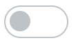

# checkbox 美化再简单不过了

传统的 checkbox 表单元素是不好看的，而且每个浏览器表现出来的样式还不一样，很多时候我们会借助一些表单美化的插件来实现类似开关切换的效果，有些是用 JS + CSS 实现的，而有些则是纯 CSS 实现的，我们更应该感兴趣的是后者。今天我们就来一步一步实现一个 checkbox 美化的效果。

开始之前我们先搞清楚原理，要给 checkbox 附样式好像不太可行，所以需要借助 label 的 for 来间接触发 checkbox 的点击切换，而我们所有需要的美化效果只需要加到 label 上即可。

首先定义如下的 HTML 结构

```html
<div class="mycheck">
  <input type="checkbox" id="check1" />
  <label for="check1"></label>
</div>
```



外部是一个 div 容器用来包装整个 checkbox，包含不可缺少的 label 元素。然后设置未选中状态的 label 样式

```css
.mycheck label {
  display: inline-block;
  border: 1px solid #bdc3c7;
  border-radius: 60px;
  width: 60px;
  height: 30px;
  position: relative;
}
```

里面的圆圈用 `::before` 来实现可以避免创建更多的元素

```css
.mycheck label::before {
  width: 20px;
  height: 20px;
  content: '';
  display: inline-block;
  background-color: #bdc3c7;
  border-radius: 100%;
  position: absolute;
  top: 4px;
  left: 4px;
}
```

然后通过 `:checked` 来表示 checkbox 的选中状态，结合 `~` 选中它后面的 label


```css
.mycheck :checked ~ label {
  background-color: #26b22b;
  border-color: #26b22b;
}

.mycheck :checked ~ label::before{
  left: 35px;
  background-color: #FFF;
}
```

直接切换有点生硬，我们可以给切换过程加上一个缓动效果，由于这里的切换包含背景颜色和圆圈位置两个地方，所以需要给 label 和它的 ::before 都加上一个 `transition` 属性

```css
.mycheck label {
  transition: all .5s;
}

.mycheck label::before {
  transition: all .5s;
}
```

整个 checkbox 美化效果就完成了，是不是很简单？需要注意的是这里的 label for 需要和 checkbox 的 id 对应起来，实际开发中，如果你用的是 Vue.js 组件，可以很轻松地做一下封装

```vue
<template>
  <div class="mycheck">
    <input type="checkbox" :id="id" />
    <label :for="id"></label>
  </div>
</template>
export default {
  data () {
    id: `check-${parseInt(Math.random(10) * 10000)}`
  }
}

<style scoped>
...
</style>
```

这里我们随机生成了一个 id 以避免手动设置，而且同时多次使用该组件也不会造成 id 冲突，当然还可以设置更多的可定制属性，随便怎么玩都可以。除了 checkbox，radio 也可以按照这种方式来进行美化，赶紧动手试试吧。