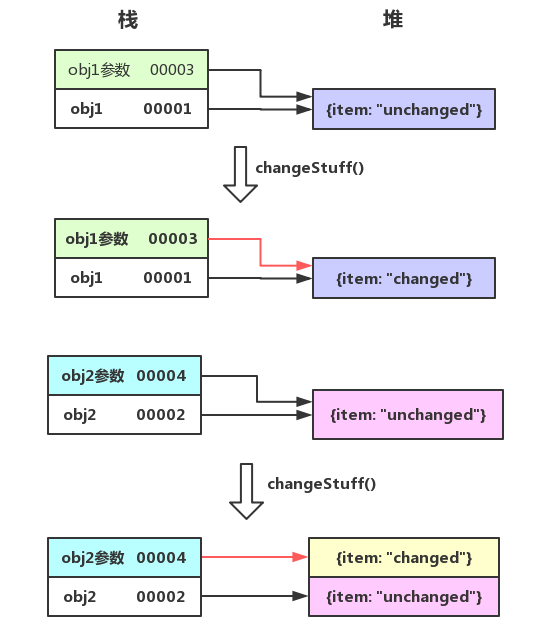

# 传值传址的本质

这是来自 stackoverflow 上的一个问题

```js
function changeStuff(a, b, c)
{
  a = a * 10;
  b.item = "changed";
  c = {item: "changed"};
}

var num = 10;
var obj1 = {item: "unchanged"};
var obj2 = {item: "unchanged"};

changeStuff(num, obj1, obj2);

console.log(num);
console.log(obj1.item);    
console.log(obj2.item);
```

结果是什么呢？想必大家都能异口同声地回答出第一个打印结果

```js
console.log(num);
// 10
```

因为对于原始值（字符串、数字、布尔值）的参数传递实际上是对该参数值进行了复制，在方法中进行的修改不会影响到原来的值，这就是所谓的传值传递。

第二个传入的是一个对象 obj1，这个时候传递的实际上是 obj1 的地址，也就是所谓的传址传递，所以对参数的修改也就是对 obj1 本身的修改了

```js
console.log(obj1.item); 
// changed
```

第三个看上去和第二个是一样的道理，都是传入的对象地址，那结果也应该和第二个一样吧？

```js
console.log(obj2.item); 
// unchanged
```

然而并非如此，为什么呢？虽然传入的参数一样，但是在方法中的处理却有区别。obj1 的处理方式是直接对该参数的某个属性进行修改，而 obj2 则是对整个参数重新进行了赋值。

似乎我们并没有理解到传址的本质，细想一下，如果 传入的真是 obj2 的地址，那么这里实际上就是将 obj2 指向新的对象 `{item: "changed"}` ，结果也应该是 changed 啊。

记住，不管是传值传递还是传址传递，最终都是传入的一份拷贝，原始类型是值的拷贝，而引用类型则是该对象在堆中地址的拷贝。值的拷贝自然是不会影响到原始值，而对象地址的拷贝则有可能会牵连到外部对象。

所以，不管是 obj1 还是 obj2，都是传入原对象地址的一份拷贝，也就是在栈中多出了一个地址变量用来指向原对象。obj1 是对复制出的地址所指向的原对象的某个属性进行的赋值操作，本质上还是在操作原对象。而 obj2 则是对复制出的地址进行的赋值，也就是将新地址进行了重新的指向，脱离了和原对象的关联，也就不会影响到原对象了。参考下图

