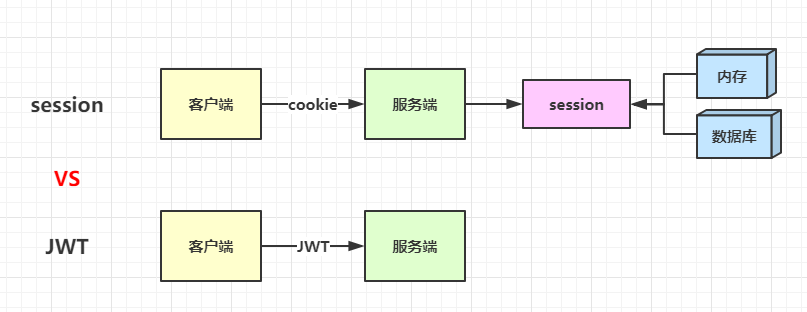
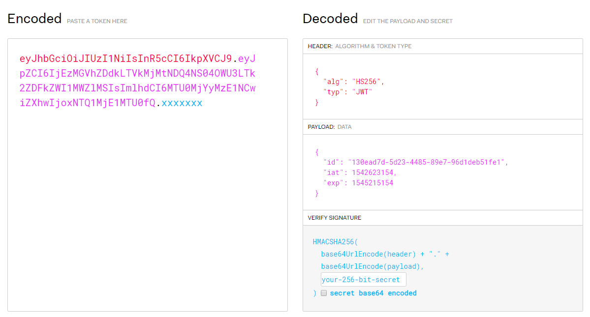

# JWT 了解一下

登录认证是每个系统都不可或缺的一个功能，传统的认证方式主要是通过 session 来实现。原理很简单，就是将身份信息存放在服务端（内存或数据库中），然后生成一个 KEY 返回，用户每次请求只需要通过 cookie 带上这个 KEY 即可。

这种方式会存在一些问题

* 1、额外的服务器存储压力
* 2、如果采用的是内存方式，那么多台服务器无法共享会话
* 3、非 WEB 端使用 cookie 不方便

于是一种轻量级的认证方式出现了，那就是 token 认证，不需要在服务端存储任何身份信息，所有的信息都被加密到一个字符串中，每次请求携带这个 token 字符串即可。这可以解决上面 session 的所存在的问题。

既然是加密，理论上我们自己可以随意实现，但是现在出现了这样一种规范 JSON Web Tokens 简称 JWT，它提供了一套完善的加密和验证标准，那我们就没理由不用这个了。可以看看二者的区别



如果你目前正在用早8点的 WEB 版，那么登录后 F12 审查任意一个有效接口请求，可以看到请求头中有一个 token 字段，类似下面的结构

```
xxx.yyy.zzz
```

可以看到这是由 3 段文本通过 `.` 拼接成的一个字符串，这便是我们今天要讲的 JWT。这 3 部分从前到后分别是

* Header
* Payload
* Signature

### Header（头部）

Header 包含两部分：token 的类型和用的哪种 hash 算法（HMAC SHA256 或 RSA）

```json
{
  "alg": "HS256",
  "typ": "JWT"
}
```

注意，最终的 header 是经过 Base64Url 编码过的，所以你需要将其解码才能看到实际的数据结构。打开 JWT 官网 https://jwt.io/ 然后将你的 token 贴到左侧的 Encoded 文本框中



### Payload（载荷）

Payload 用来存放数据主体

```js
{
  "id": "130ead7d-5d23-4485-89e7-96d1deb51fe1",
  "iat": 1542623154,
  "exp": 1545215154
}
```

`iat` 表示生成 token 的时间，`exp` 表示过期时间，这俩都是内置的参数，当然还有其它的。而我们更关心的是这里的 `id`，这是我们自行定义的，也就是把我们需要加入到 token 的信息都放在这里了，需要根据自己的业务来决定，比如早8点就存了用户 ID 一个字段，足以用来分辨当前是哪个用户发来的请求了。

### Signature（签名）

细心的同学会发现一个问题，这里我们的 Payload 存放的是用户 ID，如果把这里的 ID 改成其他用户的 ID 就会得到一个新的 token，那么我拿着这个 token 不就能登录别人的账户了？

请注意，Header 和 Payload 是通过 Base64Url 编码，很轻易就能解码，对任何人都是透明的，既然这是一个加密 token，肯定就得有不透明的部分，这一部分就是 Signature。算法如下

```
HMACSHA256(
  base64UrlEncode(header) + "." +
  base64UrlEncode(payload),
  secret)
```

这里的 `secret` 就是整个加密的核心了，你会发现，你贴入的 token 被解析出了 Header 和 Payload，但是 Signature（VERIFY SIGNATURE） 依然是留空的（your-256-bit-secret），意思是只能编码，不能解码出来。否则如果我通过自己的 token 解码拿到了这个 secret 岂不是就真像前面担心的那样，可以随意拿到任何其他用户的 token 了。

实际开发中，secret 应该作为 配置文件存在，如果发生了暴露，需要及时更改。对于前端开发来说，我们需要在每次请求中携带 token，理论上可以放到请求头、请求体、URL中，但是推荐放在 header 中，比如专门用来做认证的 Authorization 请求头

```
Authorization: Bearer <token>
```

为了提高安全性，所有使用 JWT 的网站都（非硬性）要求使用 HTTPS 协议。