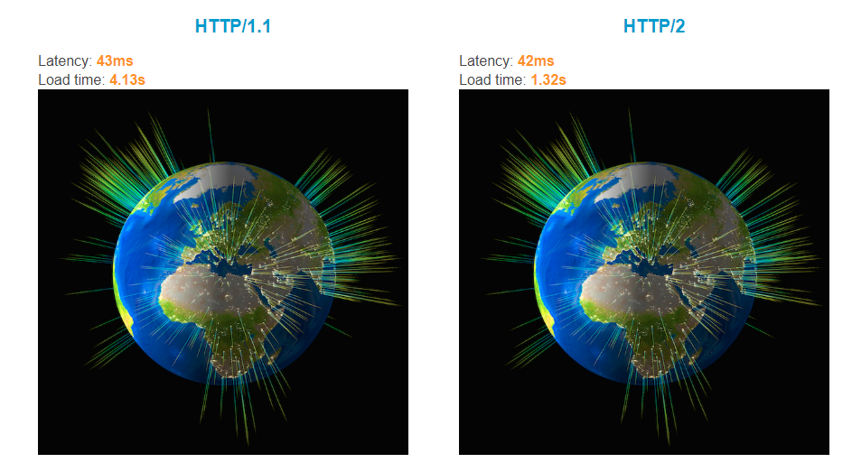
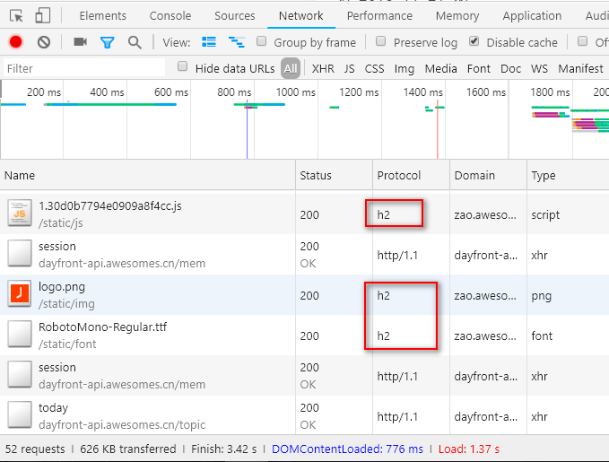
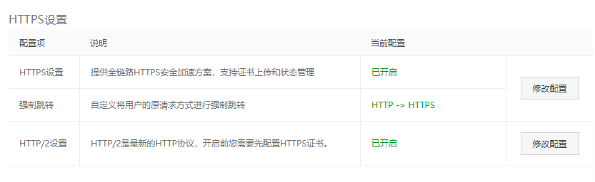

# 准备好迎接 HTTP/2 了吗？

前端性能优化中有一个很重要的方式就是使用 HTTP/2，这不是技术手段能解决的，而是从协议上入手，从底层进行优化。今天我们就来了解一下 HTTP/2 的方方面面。

### 名字

正确的名称是 HTTP/2，不是 HTTP2，也不是 HTTP/2.0。

## 谁制定的

HTTP/2 是由 IETF（国际互联网工程任务组）的 HTTP 工作组（HTTP Working Group）制定的。

### VS SPDY

SPDY 是由 Google 开发的应用层协议，用于优化网络体验，而 HTTP/2 是基于 SPDY/2 的，功能上其实有很多相似之处，但是 HTTP/2 也做了很多改进，使其更加标准化，SPDY 的核心开发者也在为 HTTP/2 做贡献。同时，Google 也开始抛弃 SPDY转而将重心放到了 HTTP/2 上。

### VS HTTP/1.x

相比于 HTTP/1.x，HTTP/2 具有如下优势：

1、HTTP/1.x 是基于文本的解析，而 HTTP/2 是基于二进制格式编码的，传输更简洁和高效。

2、采用了多路复用的机制，能够在一个 TCP 连接上同时发送多个请求，避免了排队和阻塞。

3、使用 HPACK 格式对请求头 header 中的信息进行了压缩，降低了请求大小，通过缓存加索引的方式加快了传输速度。

4、支持服务端推送。

5、提升了安全性。

下面是一个两则对比的 DEMO https://http2.akamai.com/demo

### 辨别

如何分辨自己当前的请求中哪些是 HTTP/2 呢？很简单，F12 查看 Network 面板，`Protocol` 一栏为 `h2` 的就是

### 一个连接

由于 HTTP/1 的每次请求都会打开一个 TCP 连接，而每个域中可同时开启 4-8 个连接，同一个页面可能发送了多个域的请求，算下来每个页面打开的连接得有数十个，这严重浪费了网络资源，拖慢了请求速度。

因此 HTTP/2 为了解决这个问题，只打开一个 TCP 连接，支持同时发送多个请求，大大缩短了时间。

### 是否需要加密

和 HTTP/1.x 一样 HTTP/2 并非强制 SSL，但是推荐使用。即便如此，目前很多实现都是强制 HTTPS，而且所有支持 HTTP/2 的浏览器都需要建立在 HTTPS 之上。

所以如果你要使用 HTTP/2 就必须开启 HTTPS。

### 现在可以用吗？

说了这么多，到底我们现在可不可以在自己的项目中使用 HTTP/2 了呢？can i use 的数据显示，目前主流浏览器（IE11+）都已支持 HTTP/2。经测试，即便是不支持 HTTP/2 的浏览器，也是可以访问的，只是不能享受到 HTTP/2 的特性，所以基本上是可以放心使用的。

### 如何实现

HTTP/2 协议的实现主要值的是服务端响应的请求是 HTTP/2 类型的，可以在 Nginx、Apache 这样的服务器上做配置，这需要后端开发者自己来实现。

某些第三方的 CDN 比如阿里云也提供了开启 HTTP/2 的功能，可以很方便地使用

### 是否会替代 HTTP/1.x

HTTP 工作组的愿望是使用 HTTP/1.x 的网站都能转向 HTTP/2，不过这毕竟是开发者自己决定的事，所以在相当长的一段时间内两者是共存的。

### 是否会有 HTTP/3

如果 HTTP/2 运行工作得顺利，HTTP/3 以及更多新版也会随之而来，不会再像以前那样停滞不前了。