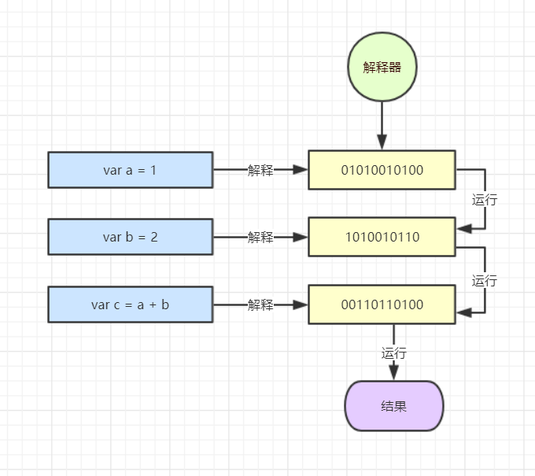
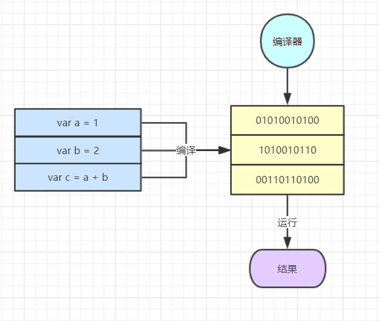
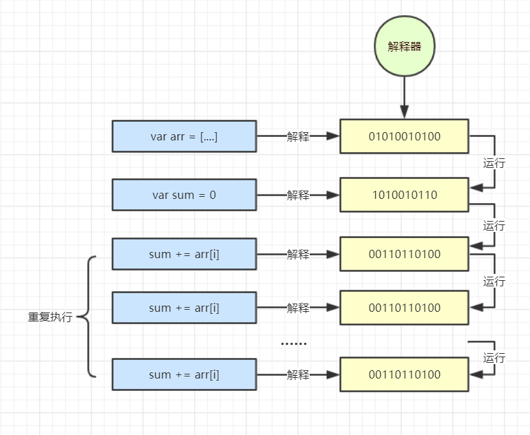
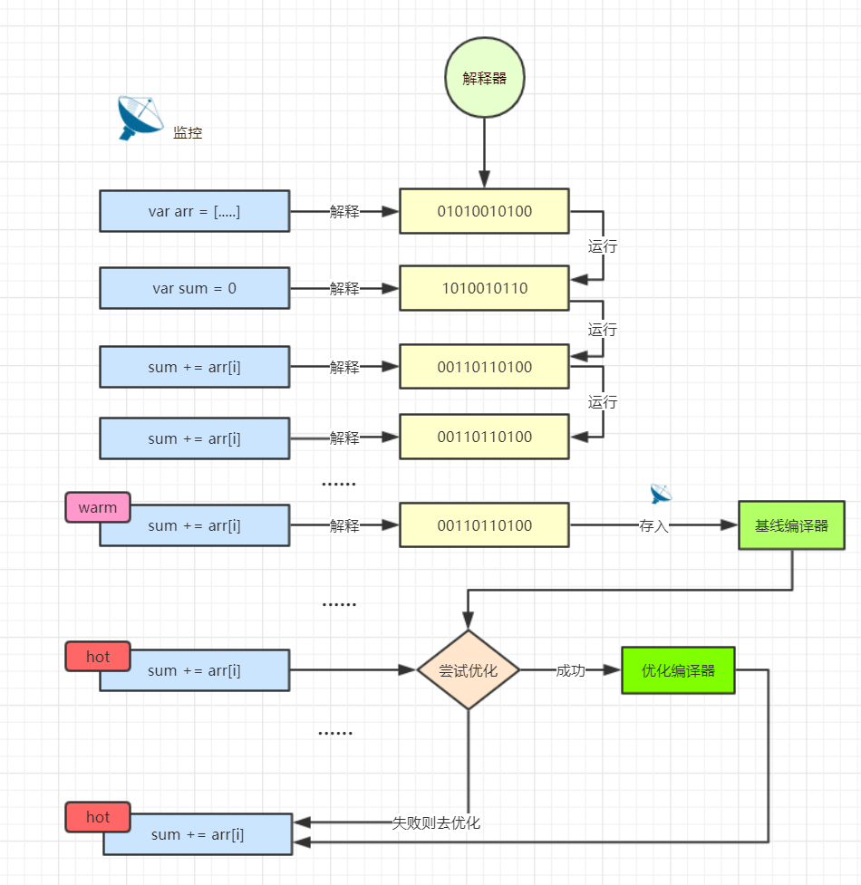

# 图解 JIT

任何程序语言从开发到运行都有一个转换过程，从可读的高级语言转成机器能运行的机器码。然而不同语言和编译器的转换过程是不一样的。

JavaScript 自然也存在这样一个过程，搞清楚具体的过程和规则是每个前端开发者都应该要做的。比如有下面一段代码

```js
var a = 1
var b = 2
var c = a + b
```

那么 JavaScript 引擎是如何执行这段代码的呢？以前浏览器的处理方式是利用**解释器**边解释边运行，过程如下图



这种方式由于不需要预先编译，所以可以快速启动，是动态语言开发者所喜欢的方式，但是不足也很明显，对于重复运行的代码，比如一个循环，那么每次都去做同样的解释是很耗性能的。

既然有边解释边运行，那么就自然存在另外一种方式：使用**编译器**进行运行前编译，这是诸如 Java 这样的静态语言采用的方式，虽然 JavaScript 并未采用这种方式，但是我们可以图示一这个下过程



那么问题来了，如何解决 JavaScript 解释器效率低下的问题呢？唯一的思路就是引入编译器的机制，由此便产生了解释器和编译器的混合模式：**JIT** 全名 Just-in-time 编译器。

比如有下面一段包含循环的代码

```js
var arr = [1, 2, 3, 4, 5, ...]
var sum = 0
for (var i = 0; i <= arr.length; i++) {
  sum += arr[i]
}
```

如果是纯解释器的话，过程如下



可以发现里面有重复解释的代码，而如果是 JIT 的话就会变成下面的过程（虽然不同浏览器之间有区别，但是核心原理都一样）



代码运行的时候会有一个监视器一直监控着，如果遇到相同的代码执行了多次，就会将其标识为 `warm`（暖和）并且送到**基线编译器**去编译，然后把结果存储起来。

如果相同代码执行次数更多后，就会被标识为 `hot`（热）接着监视器就会将它送到**优化编译器**中，生成一个更高效的版本。不过在此之前，优化编译器需要做一些假设，如果假设成功，则会运行优化后的编译代码，否则将会执行**去优化**的处理，这些代码被丢掉，转而继续回到解释器或基线编译器中。

本质上，JIT 就是通过监控代码的运行状态，对执行次数多的代码进行编译优化。由此也会产生一些额外的开销，所以还有提升的空间，如果消除掉这些开销的话，性能将会有进一步的提升。说到这里，也许有同学猜到了，没错，这正是 WebAssembly 要做的事了。