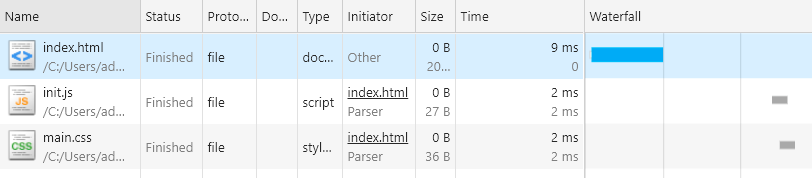

# 认识 preload

今天我们来看一个 HTML 页面

```html
<html>
  <head>
    <link rel="stylesheet" href="main.css">
  </head>
  <body>
    <script src="init.js"></script>
  </body>
</html>
```

很简单，init.js 中的代码如下

```js
console.log('加载成功')
```

运行页面之后你会看到控制台打印出了“加载成功”的文字，并且 Network 面板的请求结果如下


没什么奇怪的，因为 main.css 放在头部的，所以要比下面的 init.js 先加载。那么我有个问题，如果这个 init.js 非常重要，需要优先于页面其它资源加载，那又该怎么实现呢？

这就需要用到我们今天的主角 `preload`，这是 `<link>` 标签上 `rel` 属性的一个取值，主要用来预加载一些重要的资源。于是我们将代码改成下面这样

```html
<html>
  <head>
    <link rel="stylesheet" href="main.css">
  </head>
  <body>
    <link rel="preload" href="init.js" as="script">
  </body>
</html>
```

我们用 `<link>` 替代了 `<script>` 以达到预加载 init.js 的目的，因为 link 可以加载很多类型的资源，所以通过 `as` 来标识资源的类型。

刷新该页面可以发现网络请求变了



可以看到，即便是加载 init.js 写到了 body 中，也比写在 header 中的 main.css 先加载了，说明 preload 确实起效果了。但是，我们看一下 Console 面板，却并没有发现任何输出，也就是 init.js 并没有执行。而是在几秒之后出现了下面的警告

The resource init.js was preloaded using link preload but not used within a few seconds from the window's load event. Please make sure it has an appropriate `as` value and it is preloaded intentionally.

这又是什么情况呢？既然都加载过来了，为什么又没有执行呢？难道 init.js 仅仅是被提前加载到浏览器缓存中了，并没有去触发？没错，大家一定要明白，link preload 仅仅是用来预加载资源的，并不会去执行它。

那如果我就想马上执行呢？很简单，把 script 标签加回去即可

```html
<html>
  <head>
    <link rel="stylesheet" href="main.css">
    <link rel="preload" href="init.js" as="script">
  </head>
  <body>
    <script src="init.js"></script> 
  </body>
</html>
```

这里我们把 `<link>` 提到 `<header>` 里面去了，又多加了一个 `<script>` 标签，但是请注意，虽然多了一个 script，但是 init.js 并没有被重复加载，和上面一样也只发了一个请求而已。

整个过程是这样的，当浏览器分析到页面中有 rel=preload 的 link 标签时，就会提前去加载这些资源然后缓存起来，并且不会影响和阻塞 DOM 的 onload，当解析到 script 标签时发现已经在缓存中发现预加载过该脚本了，就会直接去取缓存中的结果。

反之，如果一直没有去执行，浏览器就会认为你提前加载了一个不会使用的资源，白白浪费了请求，也就会出现上面的警告。

所以一定要注意，加载和执行是两个步骤，link preload 要做的只是预加载，不包括执行。

有同学要说了，搞这么麻烦干什么？直接把 script 标签提到 main.css 前面不就行了

```html
<script src="init.js"></script> 
<link rel="stylesheet" href="main.css">
```

这种方式仅仅是将 init.js 放到 main.css 前面加载而已，并没有改变本质，preload 是告诉浏览器，在页面加载的生命周期的早期阶段就开始获取，在浏览器的主渲染机制介入前就进行预加载。

除了多加一个 script 标签，还可以通过下面的方式来触发执行

```html
<link rel="preload" as="script" href="init.js"
onload="var script = document.createElement('script');
  script.src = this.href;
  document.body.appendChild(script);">
```

这里我们借助了 `link` 的 `onload` 事件，即在 `init.js` 被加载完成后马上创建一个 `script` 标签，并且将其 `src` 属性指向了当前 `link` 的 `href`，也就是 `init.js`，最后将该 `script` 标签插入到了 `body` 中。

细心的同学会发现，既然可以在 link 的 onload 完成后以这种方式触发，实际上也可以在任何我们需要的时候触发，比如我们延迟 3 秒执行

```js
setTimeout(() => {
  var script = document.createElement('script');
  script.src = 'init.js';
  document.body.appendChild(script);
}, 3000)
```

除了 JS 文件，preload 还支持其他资源：`audio`，`font`，`image`，`object`，`style`，`video` 等。

比如我们要预加载一个 CSS 文件

```html
<link rel="preload" href="main.css" as="style">
<link rel="stylesheet" href="main.css">
```

但是其实 CSS 不用这么麻烦，和 JS 不一样，引入 CSS 的标签本身就是 link，所以可以直接这样

```html
<link rel="preload" as="style" href="main.css" 
  onload="this.rel='stylesheet'">
```

再比如预加载图片

```html
<link rel="preload" as="image" href="xxx.png" >
...

```

目前有部分浏览器是不支持 preload 的，比如 IE，那么究竟可不可以在开发中使用 preload 呢？其实下面这种写法是完全没问题的

```html
<link rel="preload" href="main.css" as="style">
<link rel="stylesheet" href="main.css">
```

如果浏览器不支持 preload，那么 link preload 这一行就无效，但是不影响第二行代码的执行，只是没有预加载效果而已，可以看作是一个渐进增强。所以在实际开发中，对于需要优先加载的资源，在原本标签正常工作的前提下，都建议加一条额外的 preload，事实上也已经有很多网站在这样做了。

但是注意不能使用这种写法

```html
<link rel="preload" as="style" href="main.css" 
  onload="this.rel='stylesheet'">
```

注：如果牵涉到跨域获取资源，请加上 `crossorigin` 属性