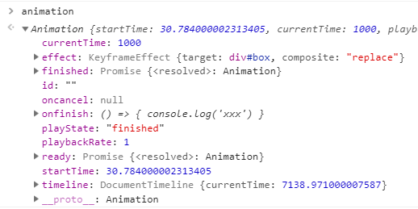

# 可控的 CSS 动画

CSS 动画给我们的页面带来了无限的酷炫效果，但是它有自己的局限性，不能灵活地控制播放和暂停，不能追踪动画的进度。既然 CSS 无法做到的事，那就只能交给 JS 来做了。

新推出的 Web Animations API 正是用来解决 CSS 动画问题的，CSS 动画能做的它都能做，CSS 动画不能做的它也能做。而且语法上还有很多相似之处。

```js
var animation = element.animate(keyframes, options)
```

keyframes 表示关键帧数组集合，options 为相关的动画参数，返回一个 Animation 对象。

比如我们有一个很常见的向右移动的动画效果，用 CSS 来实现

```css
@keyframes moves {
  from {
    transform: translateX(0)
  }
  to {
    transform: translateX(200px)
  }
}

#ele {
  animation: moves 3s linear infinite;
}
```

如果换成 animate 就变成了

```js
var ele = document.getElementById('ele')
var animation = ele.animate([
  {
    transform: 'translateX(0)',
  }, {
    transform: 'translateX(200px)'
  }
], {
  duration: 3000,
  iterations: Infinity
})
```

可以看到 animation 的结构如下



keyframes 可以简写为

```
[
  {
    transform: 'translateX(200px)'
  }
]
```

我们可以再加一个透明度

```
[
  {
    transform: 'translateX(200px)',
    opacity: 0
  }
]
```

还可以通过 `offset` 加一个帧节点控制进程，取值为 `0-1`

```
[
  {
    transform: 'translateX(50px)',
    offset: 0.4
  },
  {
    transform: 'translateX(200px)',
    offset: 1
  }
]
```

等价于 CSS 的

```css
@keyframes moves {
  40% {
    transform: translateX(50px)
  }
  100% {
    transform: translateX(200px)
  }
}
```

接下来讲讲 CSS 动画不能或不方便实现的部分。

`pause()` 用来暂停动画，比如我们希望动画在两秒之后暂停

```js
setTimeout(function () {
  animation.pause()
}, 2000)
```

继续播放则可以使用 `play()`

```js
animation.play()
```

还可以通过 `getAnimations` 拿到一个元素的所有 animate 动画实例

```js
var animations = ele.getAnimations()
```

即使只有一个动画，也会返回一个数组。如果我们想知道某个动画什么时候执行完毕，可以使用 `onfinish` 事件

```js
animation.onfinish = () => {
  console.log('执行完毕')
}
```

但如果想知道一个元素上的所有动画全部执行完毕的时候，就要用到 `finished` 属性了，这是一个 Promise 对象

```js
Promise.all(
  animations.map(
    animation => animation.finished
  )
).then(
  console.log('所有动画执行完毕')
)
```

还可以通过只读属性 `playState` 拿到正在播放的动画有哪些

```js
animations.filter(
  animation => animation.playState === 'running'
)
```

playState 表示动画播放状态，所有取值为 `pending`（挂起）`running`（运行）`paused`（暂停）`finished`（完成）`idle`（无法解析）

要批量暂停动画也很简单

```js
animations.forEach(
  animation => animation.pause()
)
```

可以看到， Web Animations API 就是对 CSS 动画的一个补充，让原本不可控的动画变得可随意操控。虽然目前支持的浏览器很少，但是我们可以使用它的 polyfill: https://github.com/web-animations/web-animations-js