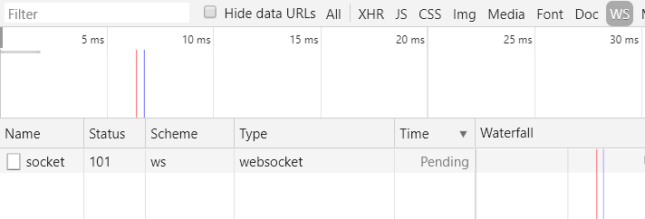
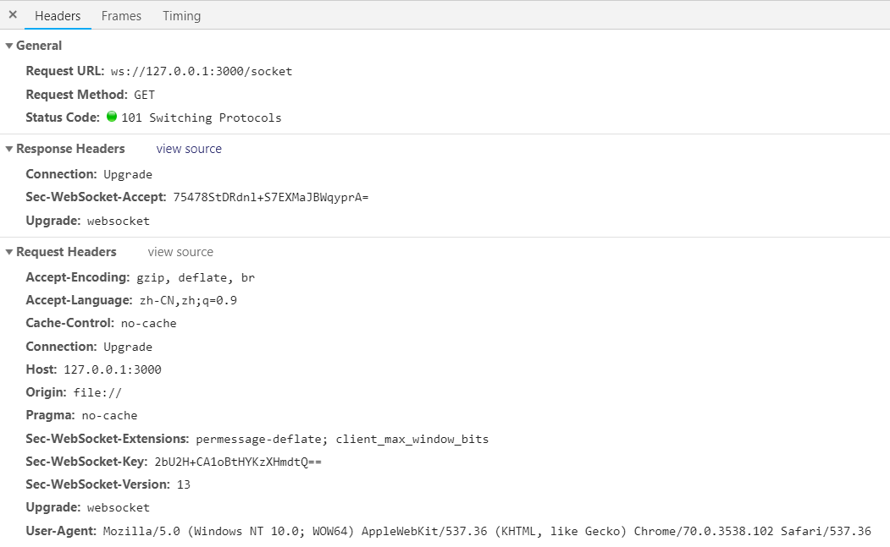
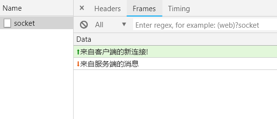

# WebSocket 不等于 Socket.io

很多时候我们需要实现消息通知的需求，有新的消息就需要通知用户，即便用户没有刷新页面，这个时候就需要服务端推送消息给客户端了。老的方式是采用轮询和长轮询，轮询就是在客户端用 setInterval 每隔一定时间就发送一个请求。长轮询就是服务端 hold 住请求，直到有新消息才返回响应信息并关闭连接，客户端处理完后又再次发起请求。本质上都是不断发送 Ajax 请求，非常浪费资源。

为了解决这个问题，就出现了 WebSocket，一个基于 TCP 的双向传输数据协议。WebSocket 连接本质上和 HTTP 一样都是 TCP 连接，并且兼容 HTTP。说到 WebSocket，大家第一个想到的肯定会是 Socket.io，这是一个很知名的用来操作 socket 框架。不过，很多同学不知道的是，其实浏览器本身就实现了 WebSocket 接口，而且主流浏览器（IE10+）都已经支持了。

有同学对这两者之间的区别和选择有点疑惑，简单说明一下，Socket.io 是一个第三方工具库，而 WebSocket 是浏览器本身实现的一套 API。WebSocket API 使用的一定是 WebSocket 协议，而 Socket.io 使用的可能是 WebSocket 也可能是长轮询。

所以 Socket.io 对浏览器的兼容性更好，因为他可以根据浏览器的支持情况自动选择使用长轮询还是 WebSocket，而且如果我们确认不需要兼容老的浏览器，还可以强制使用 WebSocket 协议。但它是始终是一个第三方框架，因此也有很多人在呼吁放弃 Socket.io 转向 WebSocket，其实目前来说没这个必要，一句话，看场景，如果你的网站需要兼容老的浏览器，那么必须得选 Socket.io，否则就直接上 WebSocket。

回到今天的主题 WebSocket，我们用 Node.js 的 Express 框架来实现一个 WebSocket 服务端。新建 server.js 文件

```js
var app = require('express')()
var expressWs = require('express-ws')(app)

app.ws('/socket', (ws, req) => {
  ws.on('message', function(msg) {
    console.log('有来自客户端的消息', msg)
  })

  setTimeout(function () {
    ws.send('来自服务端的消息')
  }, 3000)
})

app.listen(3000)
```

安装依赖

```npm
npm install express
npm install express-ws
```

然后运行 `server.js` 启动服务端

```node
node server.js
```

客户端也很简单，新建 index.html 文件，然后加入下面的 JS 代码

```js
// 创建连接
var socket = new WebSocket('ws://127.0.0.1:3000/socket')

// 打开连接
socket.addEventListener('open', function (event) {
  socket.send('来自客户端的新连接!')
})

// 监听来自服务端的消息
socket.addEventListener('message', function (event) {
  console.log('来自服务端消息 ', event.data)
})
```

我们通过 `new WebSocket` 来建立一个 WebSocket 连接，然后通过监听 `message` 来接收来自客户端的消息，并借助 `send()` 发送消息。

运行 index.html，F12 查看 Network 面板



可以看到，WebSocket 请求类型为 `websocket`，而且一直处于 `Pending` 状态，证明连接一直存在，直到手动停掉服务才会显示出一个具体的请求耗时，即请求完成。再看看请求详情



注意状态码为 `101 Switching Protocols`，表示正在进行协议切换。这是 HTTP 协议的一种特殊机制，允许将一个已建立的连接升级成新的、不相容的协议。通常是由客户端发起，以 HTTP/1 协议启动，然后升级为 HTTP/2 或者 WebSocket。

这个升级需要用到两个额外的请求头：

* `Connection: Upgrade`

* `Upgrade: websocket`

正是你从上图中能够找到的两个 header，设置 `Connection` 的值为 `Upgrade` 表示这是一个升级协议的请求，`Upgrade` 头用来指定要升级为何种协议，比如这里的 `websocket`。

响应头中的 `Sec-WebSocket-Accept` 代表着服务端允许建立 websocket 连接，结合请求头中的 `Sec-WebSocket-Key` 完成了双方的身份验证。

此外，和普通的 HTTP 请求不同的是，在 Chrome F12 的 Network 请求详情中还多了一个 `Frames` 面板，方便我们查看客户端和服务端双方的消息记录



绿色向上的箭头表示客户端发给服务端的消息，而红色向下的箭头表示服务端发给客户端的消息。