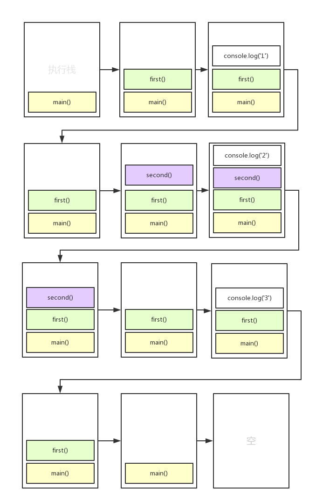
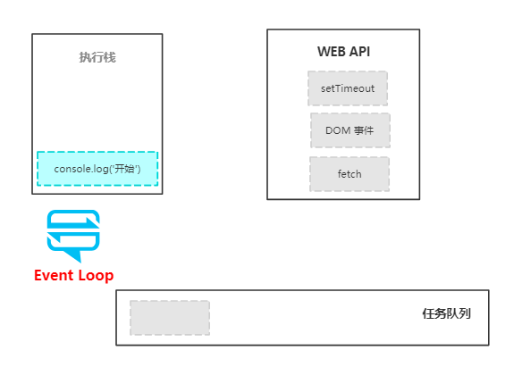
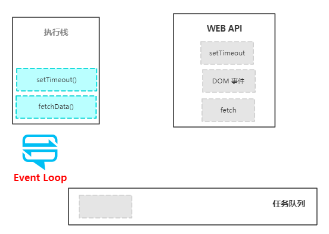
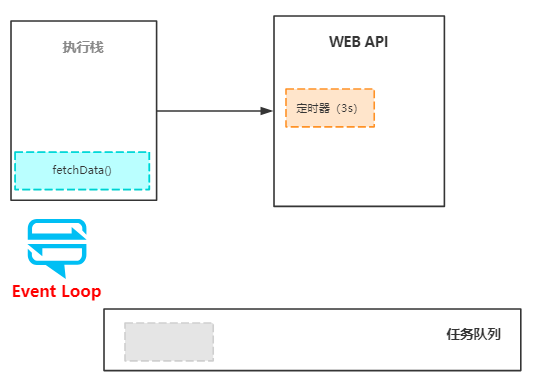
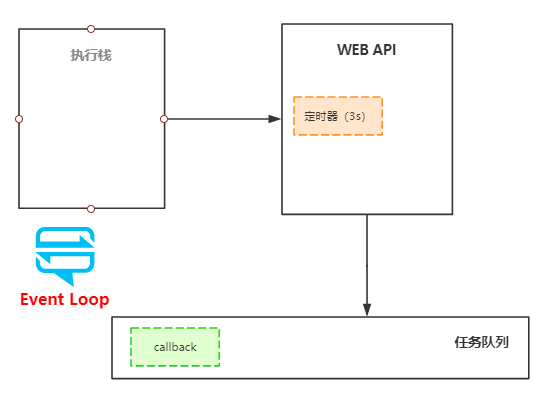
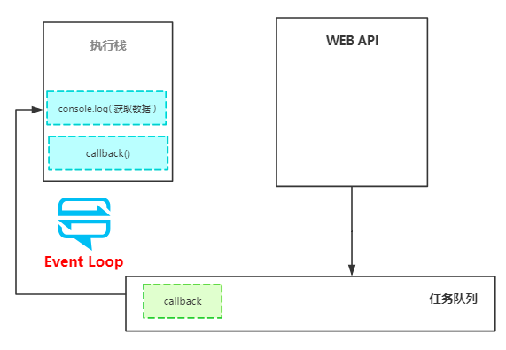

# 彻底搞懂 Event Loop

作为一个单线程的 JavaScript 引擎是如何执行异步代码的呢？相信很多同学说不清楚，本期的目标就是让大家彻底搞明白 Event Loop 的原理。我们来看下面一段普通的同步执行代码

```js
const second = () => {
  console.log('2')
}

const first = () => {
  console.log('1')
  second()
  console.log('3')
}

first()
```

在此之前我们先了解两个基本的概念

### 执行上下文

这是一个抽象的概念，表示 JavaScript 解析和执行的环境，不管什么时候执行一段 JavaScript 代码，都是在执行上下文中执行的。函数的代码运行在函数的上下文中，全局代码运行在全局的上下文中，每个函数都有自己的执行上下文。

### 执行栈

这是一个后进先出的栈，用来在代码执行过程中保存所有的执行上下文。JavaScript 只有一个执行栈，因为它是单线程的。后进先出的结构意味着每个执行上下文都会从执行栈的顶部加入和移除。

回到上面的代码，它的整个执行过程如下



当代码开始执行的时候，一个全局上下文被创建了（用 `main()` 表示）被放进了执行栈的顶部，然后要执行的 `first()` 也被放进了执行栈的顶部。

接着，`console.log('1')` 又被放进了执行栈的顶部，完成之后随即被移除了。之后又轮到了 `second()` 于是也被放了进去，`console.log('2')` 也经历了被放进和被移除的命运。接着是 `console.log('3')`，然后 `first()` 执行完毕，也被移出了执行栈，最后是全局执行上下文（`main()`）被移除，宣告了整个代码执行完毕。

不难理解，这本质上就是一个进进出出的过程，每段代码都经历了从开始执行被加入执行栈，到执行完毕被移出执行栈的过程。那么异步代码也是这样的过程吗？

我们来看一段异步代码

```js
const fetchData = () => {
  setTimeout(() => {
    console.log('获取数据')
  }, 3000)
}

console.log('开始')
fetchData()
console.log('结束')
```

当浏览器加载完上面的代码后，首先将 `console.log('开始')` 放入执行栈



注意这里我们多了一个 WEB API 环境，setTimeout 其实本身并不属于 JavaScript 引擎，而是属于浏览器的 WEB API 或者 Node.js 中的 C/C++ API。

`console.log('开始')` 执行完毕后被移除，`fetchData()` 被加入了执行栈，然后是 `setTimeout()`



接着 `setTimeout()` 在 web API 环境中开启了一个 3s 的定时器，然后 setTimeout 被移除



接着，`fetchData()` 被移除，`console.log('结束')` 也被放入和移除执行栈，与此同时，当定时器到期后，callback 被推到了任务队列中



但是 callback 并没有被立即执行，这便到了 Event Loop 的作用范围了。

### Event Loop

Event Loop 的职责就是死死盯着执行栈，一旦发现执行栈空了，就去看看任务队列里面是否有正在排队等着执行的代码，有的话就将其加入到执行栈中。

由于上面的执行栈已经空了，所以 `callback` 被 Event Loop 从队列移到了执行栈中，接着 `console.log('获取数据')` 也被放入执行栈



最后，callback 执行完成，被移出执行栈，整个代码执行完毕。

DOM 事件其实和定时器一样，也会被放入任务队列中。

### 工作队列

ES6 提出了一个新的队列叫 **工作队列**，用来存放 Promises 异步任务，任务队列和工作队列的区别是：工作队列的优先级要高于任务队列。也就是说 promise 将先于定时器被执行，我们可以用代码验证一下

```js
console.log('开始')

setTimeout(() => {
  console.log('定时器执行了')
}, 0)

new Promise(resolve => {
  resolve()
}).then(() => {
  console.log('Promise执行了')
})

console.log('结束')
```

我们分别用 setTimeout 和 Promise 创建了两个零延迟的异步代码，便于我们做比较，执行结果如下

```
开始
结束
Promise执行了
定时器执行了
```

所以，Event Loop 会先保证工作队列中没有需要执行的任务，然后才会去检查任务队列。

再次强调，Event Loop、web APIs、任务队列、工作队列并不属于 JavaScript 引擎，而是属于浏览器的 JavaScript 运行环境，或者 Nodejs 的 JavaScript 运行环境。正是由于它们的存在，JavaScript 引擎才能在正确的时间按照正确的顺序去解析和执行代码。