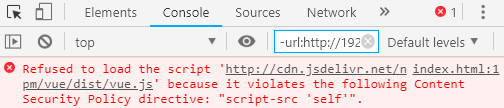

# CSP 是干啥的？

XSS（跨站脚本攻击）想必大家都听说过，这种漏洞导致的后果就是，攻击者可以在你的网站上执行非法代码。为了解决这个问题便出现了 CSP （Content-Security-Policy 内容安全策略），它可以精确控制当前页面可以引用哪些资源，可以执行哪些脚本。

将如下的 HTML 代码保存成一个 HTML 文件，然后在 Chrome 中打开

```html
<html>
  <head>
    <meta http-equiv="Content-Security-Policy" content="script-src 'self'">
    <script src="http://cdn.jsdelivr.net/npm/vue/dist/vue.js"></script>
  </head>
</html>
```

F12 打开 Console 面板你会发现报错了



很奇怪，报错大致意思是：加载脚本失败，因为违反了内容安全策略。我们可以分析一下，整个页面最有可能导致这个报错的就是这个 `<meta>` 标签

```html
<meta http-equiv="Content-Security-Policy" content="script-src 'self'">
```

不信你可以去掉这行代码就能正确加载上面的 JS 文件了。接下来我们就来详细了解一下这个神奇的标签。

其实 meta 并不是重点，重点是 `Content-Security-Policy`，如果我们给一个页面加入了这样一个 `meta`，那么就能控制当前页面能够加载哪些资源文件。接下来我们要关注的就是这个 `content` 值。

这里的 `script-src 'self'` 其实从字面意思不难猜测，就是指定 script 标签的加载白名单，`self` 应该指的就是当前域。于是当我们加载的 JS 文件不在当前域，也就会报错了。

所以我们可以做一下调整

```html
<meta http-equiv="Content-Security-Policy"
  content="script-src 'self' http://cdn.jsdelivr.net"
>
```

再次请求加载该文件就完全没问题了。

### 资源类型

除了限制 script，还有很多其它的资源可以做限制，常见的有

* `default-src` 对所有资源的默认设置
* `script-src` JavaScript 脚本
* `style-src` CSS 样式
* `img-src` 图片
* `connect-src` AJAX、 WebSocket 和 EventSource
* `font-src` 字体文件
* `object-src` 作用于 `<object>` 标签
* `media-src` 作用于 `<audio>` 和 `<video>` 标签

使用方法都一样，比如要限制图片加载

```html
<html>
  <head>
    <meta http-equiv="Content-Security-Policy" content="img-src self">
  </head>

  <body>
    
  </body>
</html>
```

上面的图片是加载不到的，需要扩展一下

```html
<meta content="img-src self *" ...>
```

多个资源类型定义之间需要用分号 `;` 分隔

```html
<meta http-equiv="Content-Security-Policy" content="
  img-src self *;
  script-src 'self' *"
>
```

### 来源

除了 `self`，这个来源限制还可以取哪些值呢？我们来看一下所有资源类型的来源列表

* `*` 允许来自任何 URL，但是 Data URI 除外
* `'none'` 不允许从任何地方引入资源
* `'self'` 允许加载同域资源
* `data:` 允许加载 Data URI 格式的资源
* `http://xxx.com` 允许指定的具体某个 http URL
* `https://xxx.com` 允许指定具的体某个 https URL
* `https:` 允许加载 https 协议的资源

下面的值只针对 script 和 style 资源

* `'nonce-'` 允许加载相同 nonce 属性值的资源
* `'unsafe-inline'` 允许内联 script 或 style
* `'unsafe-eval'` 允许 eval 代码（不管是内联还是外链）
* `'sha256-'` 允许相同 hash 值的 script 或 style

注意这里某些值必须加单引号，有些不需要加，搞错了会没有效果的。同一资源类型的多个来源以空格分割。

实际上，如果没有这个 meta 标签或者 content 里面不包含 script-src 的定义，默认是允许所有的脚本加载和运行的，一旦我们定义了，就会按照上面的规则来限制。

我们来看几个常见的错误例子（省略了 `http-equiv="Content-Security-Policy"`）

##### 错误写法 1

```html
<meta content="default-src *" ... >
<script>
  var a = 1
</script>
```

要想执行内联脚本就必须加 `'unsafe-inline'`，所以正确写法是

```html
<meta content="default-src 'unsafe-inline'" ... >
```

或者使用 `'nonce-'` 标记

```html
<meta content="default-src 'nonce-myjs'" ... >
```

##### 错误写法 2

```html
<meta content="default-src 'unsafe-inline'" ... >
<script>
  eval('var a = 1')
</script>
```

这里我们既内联执行了脚本，又执行的是特殊的 `eval` ，所以需要同时拥有 `'unsafe-eval'` 和 `'unsafe-inline'`，因此正确写法是

```html
<meta content="default-src 'unsafe-eval' 'unsafe-inline'" ... >
```

##### 错误写法 3

```html
<meta content="default-src *" ...>
<script src="data:text/javascript,alert('hello')"></script>
```

因为这里的外链不是常规的 URL，而是 data URI，而 `*` 的范围是不包含这个的，所以正确写法是

```html
<meta content="default-src data:" ...>
```

##### 错误写法 4

```html
<meta content="script-src https://cdn.jsdelivr.net" ...>
<script src="http://cdn.jsdelivr.net/npm/vue/dist/vue.js"></script>
```

这里我们允许的是 `https://...` 而实际用的却是 `http://...`，同样，不带协议也是错误的

```html
<meta content="script-src cdn.jsdelivr.net" ...>
<script src="http://cdn.jsdelivr.net/npm/vue/dist/vue.js"></script>
```

所以协议和地址都要一致，正确写法是

```html
<meta content="script-src http://cdn.jsdelivr.net" ...>
<script src="http://cdn.jsdelivr.net/npm/vue/dist/vue.js"></script>
```

或者

```html
<meta content="script-src https://cdn.jsdelivr.net" ...>
<script src="https://cdn.jsdelivr.net/npm/vue/dist/vue.js"></script>
```

### Response Header

除了前端以 meta 的方式设置 CSP，服务端也可以通过 `Content-Security-Policy` 响应头来设置，比如 nginx 可以给 `server` 节点加上下面的配置

```nginx
add_header Content-Security-Policy "default-src 'self';";
```

这样网站所有页面就只允许加载当前域的资源了。