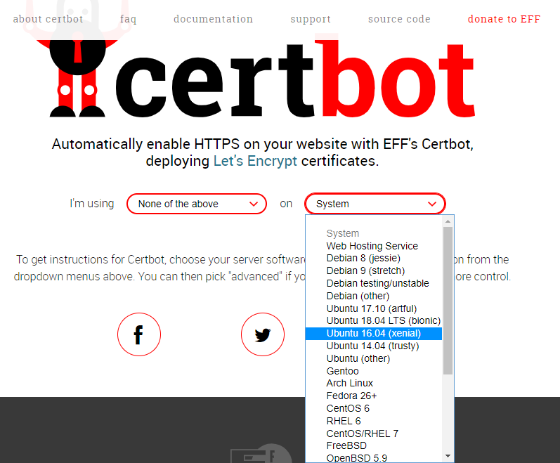
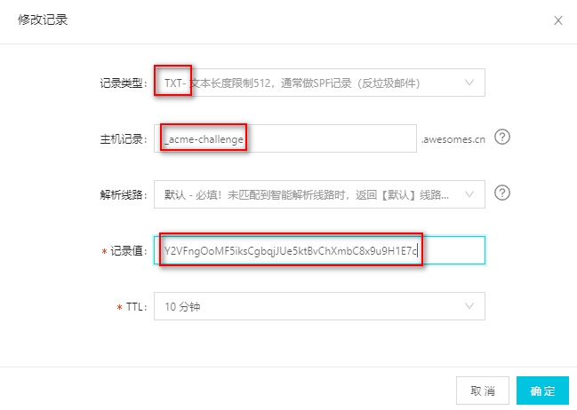
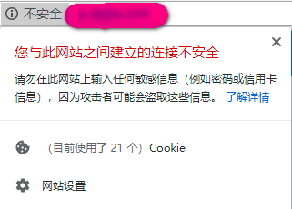
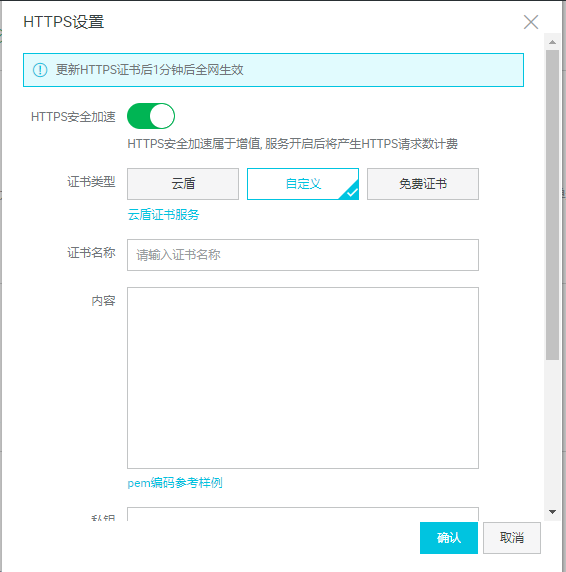

# Let's Encrypt 实践指南

如今越来越多的网站已经亮起了绿色小锁，HTTPS 作为 HTTP 协议的加密版本，借助 SSL 或者 TLS，我们能够从中得到安全的数据传输，特别是那些敏感的数据，不过当下 HTTPS 已经普及开来了，算得上是一个网站的标配。

作为一名大前端，应该知道如何将自己的网站或博客切到 HTTPS。

开始之前我们需要选择证书，免费开源的 Let's Encrypt 无疑成为了我们的首选，因为它是由 Mozilla、Chrome、EFF 等大佬组织开发和维护，而且整个证书的操作过程是自动化的，不像传统证书需要人工干预。这得益于它的 ACME 协议，正是这个协议规范了证书的申请、更新等流程。

所以要想申请 Let's Encrypt 证书，只需要借助一个实现了 ACME 协议的客户端即可，而官网推荐的正是 Certbot 这个工具，于是接下来我们就用 Certbot 来生成自己的证书。

其实整个过程很简单，大致如下：

* 1、安装生成证书的工具 Certbot
* 2、用 Certbot 生成指定域名的证书
* 3、修改服务器配置引用证书

注意，这里安装 Certbot 生成证书的服务器可以不是运行网站的服务器，比如我的网站运行在 A 服务器上面，但我可以跑到 B 服务器上面去生成证书，然后复制到 A 供其使用。本质上其实你需要的就是几个证书文件中的加密内容而已。

如果你的网站运行在多个服务器上面（如Docker 集群部署），那么我们最好在构建服务器上面统一生成证书，然后通过 scp 命令复制到所有的运行服务器上面。

### 安装 Certbot

有两种方式安装 Certbot，一种是系统安装，一种是直接下载 GitHub 源码使用。注意 Certbot 只支持类 UNIX 系统，不支持 Windows。

按照 Certbot 官网的指示选择对应的服务器和系统安装，比如我们要安装到 Ubutnu 16.4 系统上



然后会告诉你运行下面的命令

```nginx
$ sudo apt-get update
$ sudo apt-get install software-properties-common
$ sudo add-apt-repository universe
$ sudo add-apt-repository ppa:certbot/certbot
$ sudo apt-get update
$ sudo apt-get install certbot 
```

接下来就可以这样使用

```nginx
certbot certonly ....
```

或者直接下载 GitHub 源码

```git
git clone git@github.com:certbot/certbot.git
cd certbot
```

然后使用方式变成了

```nginx
./certbot-auto certonly  ....
```

这种方式第一次使用的时候会花点时间自动下载当前系统所需的文件。

### 生成证书

假设我们的网站是 `www.awesomes.cn` 那么我们可以运行下面的命令

```nginx
certbot certonly  -d www.awesomes.cn --manual --preferred-challenges dns --server https://acme-v02.api.letsencrypt.org/directory 
```

* `certonly` 表示安装模式（另外一个是调试模式）
* `-d` 表示目标网站
* `--manual` 表示手动安装插件
* `--preferred-challenges` 指定校验域名所有权的方式为 DNS
* `--server` 协议使用的服务器地址

其中有一些交互提示，需要同意方可继续，然后就到了验证域名所有权的阶段，控制台会有下面的提示

```nginx
Please deploy a DNS TXT record under the name
_acme-challenge.www.awesomes.cn with the following value:

Y2VFngOoMF5iksCgbqjJUe5ktBvChXmbC8x9u9H1E7c

Before continuing, verify the record is deployed.
```

这个时候我们需要给自己的域名加一条值为 `Y2VFngOoMF5iksCgbqjJUe5ktBvChXmbC8x9u9H1E7c` 的 TXT 的解析。



最终我们会收到一个生成证书成功的提示，证书被放到了 `/etc/letsencrypt/live/www.awesomes.cn/` 文件夹下面，并标明了有效期，目前 Let's Encrypt 证书的有效期是 3 个月，也就意味着 3 个月之后需要更新证书。

到此为止，我们已经通过 Certbot 工具得到了一个证书文件夹，这里面的文件也就是我们下一步需要用到的。

### 使用证书

如果网站部署在自己的服务器上面，我们以 Nginx 为例来看看配置

```nginx
server {
  listen 443 ssl http2;
  server_name www.awesomes.cn;
  ssl on;
  ssl_protocols TLSv1 TLSv1.1 TLSv1.2;
  ssl_certificate /etc/letsencrypt/live/www.awesomes.cn/fullchain.pem;
  ssl_certificate_key /etc/letsencrypt/live/www.awesomes.cn/privkey.pem;
  ssl_session_timeout 5m;
  ssl_ciphers ALL:!ADH:!EXPORT56:RC4+RSA:+HIGH:+MEDIUM:+LOW:+SSLv3:+EXP;
  ssl_prefer_server_ciphers on;
  location / {
  }
}
```

我们将配置加到了 `server` 块里面，这里的重点是下面 3 句

```nginx
listen 443 ssl http2;
ssl_certificate  <fullchain.pem文件地址>
ssl_certificate_key <privkey.pem文件地址>
```

`listen` 标识了这是 HTTPS 协议，并且顺带加上了 `http2`，因为 HTTP/2 不仅能弥补 HTTPS 的性能消耗，还会提升一定的性能。`ssl_certificate` 和 `ssl_certificate_key` 分别指向我们上面生成的证书文件。

正如前面提到的，如果证书文件和 Nginx 不在同一台服务器上面，那么需要将证书手动复制到 Nginx 所在的服务器上。

这个时候，我们访问 `https://www.awesomes.cn` 就可以看到网站已经开启 HTTPS 了，如果你再 F12 看一下请求，可以发现请求类型为 `h2`。

注意，有可能地址栏中不是绿色小锁，而是感叹号



这说明你的主站是 HTTPS 的，但是里面加载了非 HTTPS 的资源，比如你将资源文件放到了第三方的云存储上，那么也需要将这些资源改为 HTTPS 引用。

很多用户其实喜欢直接输入 `www.awesomes.cn` 访问的仍旧是 HTTP，那么我们就需要加一个强制跳转

```nginx
server {
  listen  80;
  server_name    www.awesomes.cn awesomes.cn;
  rewrite ^(.*)$  https://www.awesomes.cn$1 permanent;
}
```

### CDN 使用

如果你的网站或者上面说的资源文件放在云储存上面，比如阿里云 OSS，那么你需要给绑定的 CDN 域名加上证书，当然他们会提供付免费或付费的证书，但是我们还是想用上面生成的 Let's Encrypt，这个时候就需要手动将这两个证书文件内容填写进去了。



注意，阿里云 OSS 中需要的私钥格式不一样，得先手动转换一下

```nginx
openssl rsa -in privkey.pem -out new_privkey.pem
```

然后将 `new_privkey.pem` 文件中的内容填入即可。

不过 3 个月之后更新的证书需要重新手动填写，这一块算是比较麻烦的。不知道云存储服务商未来会不会针对这个问题提供解决方案。

### 更新证书

一般我们会在 2 月左右提前更新证书，执行下面的命令即可

```nginx
sudo certbot renew 
```

当然也可以根据自己的需求写到定时任务或者其他自动化工具里面去。