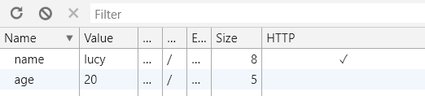

# cookie 那些事

前面我们讲过了 Web Storage，但是很多同学可能已经忘了最初的存储方式：cookie，今天我们就来回顾一下 cookie 的那些事。

### cookie 是什么

相比于 Web Storage，cookie 只能存储最多 4kb 的数据，而且是一个纯字符串。核心差异是，cookie 会随着每次请求往返于客户端和服务端，主要用来携带 session 做身份认证。虽然目前有很多应用是以类似 JWT 这样的 Token 认证方式，但是仍旧有很多网站走的 cookie。

### 设置

在客户端设置 cookie 很简单

```js
document.cookie = 'name=tom'
```

内容为 `=` 连接的字符串，等号两边可以有空格，这种并非是覆盖式的赋值方式，而是新增一个 cookie 键值对

```js
document.cookie = 'name=tom'
// "name=tom"

document.cookie = 'age=20'
// "name=tom; age=20"

document.cookie = 'name=lucy'
// "age=20; name=lucy"
```

那同学要说了，如果我不是以这种方式赋值呢？只给一个不包含 `=` 的字符串会怎样？

```js
document.cookie = 'xxx'
// "age=20; name=lucy; xxx"

document.cookie = 'yyy'
// "age=20; name=lucy; yyy"
```

通过 Application 面板中的 Cookies 可以看到，实际上这是了一个 `Name` 为空，`Value` 为 `xxx` 的 cookie，所以第二次设置 `yyy` 的时候就将 xxx 给覆盖了。

除了客户端，服务端也可以通过响应头 `Set-Cookie` 设置 cookie，比如我们用 Node.js Express 来设置

```js
const express = require('express')
const app = express()

app.get('/', (req, res) => {
  res.header('Set-Cookie', ['name=lucy', 'age=20'])
  res.send('Hello World!')
})

app.listen(3000)
```

### 获取

由于 cookie 是一个纯字符串，所以获取出来的也就是以 `=` 和 `;` 连接的字符串而已。要想拿到对应键的值，是需要做一些处理的，比如使用正则来提取

```js
function getCookie(key) {
  const result = /.*${key}=([^;]*)/.exec(document.cookie)
  if(result) {
    return result [1]
  }
}
```

然后就可以这样获取了

```js
getCookie('name')
// lucy
```

当然实际开发中可以借助一些第三方库来操作。

### 过期

前面讲过，localStorage 只能手动实现过期机制，而 cookie 本身是可以设置过期时间的，默认是关闭页面时过期，也可以通过两种方式手动设置。

第一种是 `expires` 选项，设置具体在什么时间过期，比如我们要在 1 分钟后过期

```js
const now = new Date()
now.setMinutes(now.getMinutes() + 1)
document.cookie = `name=tom;expires=${now.toUTCString()};`
```

接着 1 分钟之后你会发现 `name` 键从 `document.cookie` 中消失了。不过这种方式不太好用，我们还是习惯通过时间戳的方式，这时可以使用 `max-age`，表示在多少秒后过期，上面的写法等价于

```js
document.cookie = 'name=tom;max-age=60'
```

### 安全

既然客户端能够操作 cookie，那就很容易会出现安全问题（跨站脚本攻击），特别是对于敏感信息，比如 session，我们需要做一些安全上的保护措施。

有这样一个选项 `HtppOnly` 用来标识该 `cookie` 不能用 JS 在浏览器端操作，也许只需要加上 `HtppOnly` 选项即可

```js
document.cookie = 'token=xxx; HttpOnly'
```

当然，直接打印 document.cookie 是看不出效果的，只能通过 F12 的 cookie 面板查看区别。不过遗憾的是并没有任何效果。为什么呢？其实很好理解，`HttpOnly` 既然是用来阻止 JS 操作 cookie 的，你却要用 JS 来设置该选项，显然是自相矛盾的。

```js
res.header('Set-Cookie', ['name=lucy; HttpOnly', 'age=20'])
```

然后你会发现在 `HTTP` 一列中，`name=lucy` 打了一个 `✓`



### 域

cookie 默认只能在当前域设置和获取，比如你在 `www.google.com` 设置的 cookie 是不能在 `plus.google.com` 中获取的。

但是我们可以通过 `domain` 选项来修改

```js
document.cookie = `name=tom;domain=google.com`
```

这个时候就可以在 `plus.google.com` 中访问到这个 cookie 了。注意，这里的前提条件是，要修改成的域必须和当前域在同一个主域下。

### 路径

如果要限定一个 cookie 只能在满足某个条件的页面操作，可以使用 `path` 选项

```js
document.cookie = `name=tom;path=user`
```

这就意味着你可以在 `http://xxx.com/user` 中访问这个 cookie，却不能在 `http://xxx.com/` 中访问。