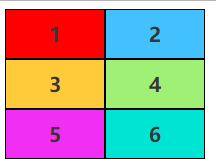

# Grid 快速体验

CSS 网页布局经历了从 table 到 div 再到现在流行的 flex，灵活和易用性都在不断提升，然而还没完，新的网格布局 CSS Grid 已经慢慢被越来越多的浏览器支持了，实在没理由去忽视它，今天我们就快速过一遍 Grid，了解一下它的大致使用方法。

首先我们来看一段 HTML 结构

```html
<div class="box">
  <div>1</div>
  <div>2</div>
  <div>3</div>
  <div>4</div>
  <div>5</div>
  <div>6</div>
</div>
```

然后给上一些好看的样式，默认会从上到下堆起来


接着，我们要让其变成网格布局，只需要给外部容器加上一段样式即可

```css
.box {
  display: grid;
}
```

刷新页面你会发现压根没变，这是因为我们还没有定义里面的 item 项如何分配空间，所以我们稍作修改

```css
.box {
  display: grid;
  grid-template-columns: 100px 100px;
  grid-template-rows: 50px 50px 50px;
}
```

我们通过 `grid-template-columns` 定义了该网格有多少列，并且每列的宽度为 `100px`，`grid-template-rows` 定义有多少行，每行高度为 `50px`，所以实际上就生成了一个 3 行 2 列的等宽等高网格



不光可以设置具体多少像素，还可以用 `auto` 实现自适应

```css
.box {
  grid-template-columns: 100px auto;
}
```


此外还可以使用 `fr` 来表示按照什么比例来分配剩余空间，比如第 1 列为 3/4，第 2 列为 1/4，可以这样写

```css
.box {
  grid-template-columns: 3fr 1fr;
}
```

所以，如果我们想让两列铺满容器并且均分的话可以有下面几种写法

```css
grid-template-columns: 1fr 1fr;
grid-template-columns: auto auto;
grid-template-columns: 50% 50%;
```

此外，还可以通过 `repeat` 来快速定义相同宽度的列

```css
grid-template-columns: repeat(4, 1fr);
```

表示 4 列等宽，等价于

```css
grid-template-columns: 1fr 1fr 1fr 1fr;
```

继续，我们将外部容器定义成了3行2列，如果我们想让第一项铺满该怎么做呢？


和 flex 一样，Grid 的最终样式不光是由外部容器决定的，内部的项也可以定义自己的样式，所以我们可以这样做

```css
.box div:nth-child(1) {
  grid-column-start: 1;
  grid-column-end: 3;
}
```

`grid-column-start` 当前项表示从第几列开始，`grid-column-end` 到第几列结束。注意，这里所说的第几列需要参考下面的图示


可以用 `grid-column` 简写

```css
.box div:nth-child(1) {
  grid-column: 1 / 3;
}
```

当然同样也可以定义行

```css
.box div:nth-child(1) {
  grid-row: 1 / 4;
}
```


最后我们来看一个稍微复杂一点的布局


代码如下，大家可以自己先练习再看答案

```css
.box {
  display: grid;
  grid-template-columns: 100px 100px 100px;
  grid-template-rows: 50px 50px 50px;
}
.box div:nth-child(1) {
  grid-column: 1 / 3;
}
.box div:nth-child(3) {
  grid-row: 2 / 4;
}
.box div:nth-child(4) {
  grid-column: 2 / 4;
}
```