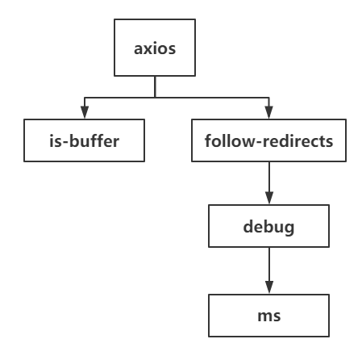
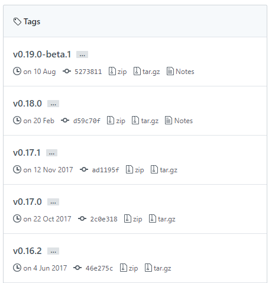

# package-lock 到底做了什么？

前面我们讲过 package.json 中版本号的规则，很多情况下容易因为小的版本号差别引起项目崩溃，所以需要某种程度的锁定依赖版本号。当时我们提了一下最佳解决方案是使用 `package-lock.json`，今天我们就来详细说说这个文件到底是怎么回事。

本期以动手为主，通过 `npm init` 新建一个新的 Node.js 项目，然后安装一个老版本的 `axios`

```npm
npm install axios@0.17.0
```

这个时候你会发现 `package.json` 文件中加了一条内容

```json
"dependencies": {
  "axios": "^0.17.0"
}
```

并且生成了一个 `package-lock.json` 文件，这个文件的功能就是列出当前安装了哪些包和具体的版本号，包括包与包之间的依赖关系，部分内容如下

```json
{
  "dependencies": {
    "axios": {
      "version": "0.17.0",
      "requires": {
        "follow-redirects": "1.5.10",
        "is-buffer": "1.1.6"
      }
    },
    "debug": {
      "version": "3.1.0",
      "requires": {
        "ms": "2.0.0"
      }
    },
    "follow-redirects": {
      "version": "1.5.10",
      "requires": {
        "debug": "3.1.0"
      }
    },
    "is-buffer": {
      "version": "1.1.6",
    },
    "ms": {
      "version": "2.0.0"
    }
  }
}
```

从中我们可以看到确实是安装了 `0.17.0` 版本的 `axios`，整个的依赖树形结构如下



虽然是树形结构，但是上面的 JSON 内容却是扁平的，通过 `requires` 来指定关系，这样做的好处是可以复用依赖。简单说就是从下面的写法

```
A-->B-->C-->F
D-->B-->C-->F
```

变成了

```
A
B
C
F
```

省掉了重复的 BCF。

不嫌麻烦的同学可以分别进到每个库的 GitHub 里面去看看各自对应版本的 `package.json` 中的依赖，确认一下是不是和上面的结构吻合。

前面我们讲过 `^0.17.0` 这种格式的版本规则，理论上如果团队成员 clone 你的项目再次 `npm install` 的话，那么实际安装的 axios 版本应该在 `>=0.17.0` 且 `<0.18.0`。

我们来模拟一下整个过程，将生成的 `package-lock.json` 文件和 `node_modules` 文件夹删掉。再次 `npm install` 你会发现 `package-lock.json` 部分变成了

```json
"axios": {
  "version": "0.17.1"
}
```

不过所料安装了一个 `> 0.17.0` 的版本，因为 `axios` 的版本记录为



注意，上面我们是将 `package-lock.json` 文件给删掉了，如果我们不删这个文件，把它纳入版本控制里面，那么团队成员拉取到的源码中就会包含这个文件，又会是什么结果呢。

接下来我们重新走一遍，将 package.json 中的以下部分删掉

```json
"dependencies": {
  "axios": "^0.17.0"
}
```

再次 `npm install`，你会发现 `node_modules` 文件夹被删掉了，然后 `package-lock.json` 文件 `dependencies` 部分也被清除了。

所以我们可以得出一个结论，当我们 `npm install` 的时候，npm 会去检查 package.json 中的依赖是否变化，如果有变化就去更新 package-lock.json 中的树形结构。

接着我们再次执行

```
npm install axios@0.17.0
rm -rf node_modules
```

这一次我们只删除 node_modules，不删 package-lock.json，模拟了一个带有 package-lock.json 的新环境。

再次 `npm install` 的结果是，package-lock.json 没有任何变化，axios 还是保持了 `0.17.0` 版本，所以就达到了锁定版本的效果。