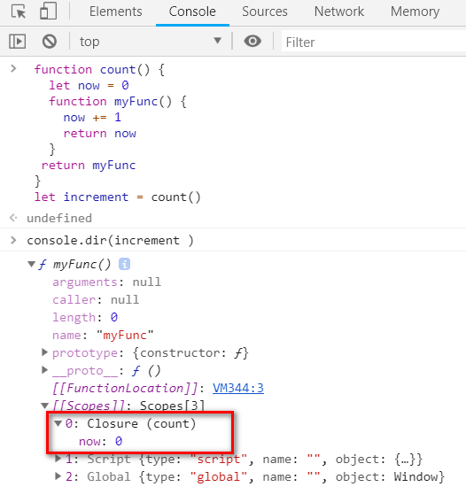

# 闭包啊闭包

闭包这个话题是每个前端开发者都无法避开的，也成为了面试中的常见问题，或许你能说出自己背下来的答案，但是很少有同学会能真正搞懂其中的原理。知其然，更要知其所以然，今天我就来带领大家通过剖析闭包的代码，让大家彻底明白闭包这个概念。

看下面一段经典的闭包应用代码

```js
 1: function count() {
 2:   let now = 0
 3:   function myFunc() {
 4:     now += 1
 5:     return now
 6:   }
 7:   return myFunc
 8: }
 9: let increment = count()
10: let r1 = increment()
11: let r2 = increment()
12: let r3 = increment()
13: console.log(r1, r2, r3)
```

那么 JavaScript 解析器是如何执行这段代码的呢？前面章节我们图解过执行栈和执行上下文，今天我们再一步一步解释一下上面代码的执行过程。

1、行 1-8 在全局执行上下文中定义了一个新的变量 `count`，被赋了一个函数定义。

2、行 9 在全局执行上下文中定义了变量 `increment`。

3、行 9 执行 `count` 函数，并且将其返回值赋给变量 `increment`。

4、然后再次来到行 1-8，创建了一个本地执行上下文。

5、行 2 在本地执行上下文中定义了一个变量 `now` 赋值为 `0`。

6、行 3-6 到了核心步骤，在本地执行上下文中定义一个变量 `myFunc`，变量内容是一个新的函数定义，同时我们也会创建一个闭包，并且让其成为函数定义的一部分，这个闭包包含了该函数所处的作用域内的变量，也就是 `now`。我们可以这样用下面这段伪代码帮助理解

```js
myFunc.闭包 = {
  now: 0
}
```

所以，只要 `myFunc` 这个函数（或者被赋给其它变量）存在，它的闭包就会一直跟着存在。

7、行 7 返回了 `myFunc` 变量的内容，本地执行上下文被销毁， `myFunc` 和 `now` 变量不复存在，但返回了 `myFunc` 的函数定义和它的闭包。

8、行 9 在全局执行上下文中定义了 `increment` 变量，其值为 `count` 函数的执行结果，于是 `increment` 变量现在包含了一个函数定义和闭包，它不再是 `myFunc` ，但是在全局执行上下文中，它有了一个新的身份 `increment` 。

9、行 10 定义了一个新的变量 `r1` 暂时赋值为 `undefined` 。

10、行 10 发现有 `()` 表示这是一个需要执行的函数，于是查找变量 `increment` ，找到后执行该函数，它包含了 4-5 行返回的函数定义。

11、开始执行 `increment` 函数，创建一个本地执行上下文。

12、行 4 我们需要去找一个变量 `now` ，当前函数中并不存在这个变量，然后在去全局执行上下文中查找之前，我们会先检查一下闭包，最后发下闭包中确实包含一个变量 `now` 值为 `0` 。执行完 `now += 1` 后，它的值变成了 `1` ，然后又将这个值存回了闭包中的 `now` 变量中，于是现在闭包中 `now` 的值就变成 `1` 了。

13、行 5 我们返回了 `now` 的值 `1` 然后销毁了本地执行上下文。

14、回到行 10，返回值 `1` 被赋给了 `r1` 变量。

15、行 11-12 又重复了上面的执行过程，闭包中的 `now` 也再次经历了被取出，被 `+1` ，又被存回到闭包中的过程，最终变成了 `3`。

16、行 13，打印出 `r1` `r2` 和 `r3` 的值，分别是 `1 2 3`。

每当一个函数被声明的时候，它就会包含一个函数定义和闭包，这个闭包包含该函数所处的上下文（也就是父级作用域）所有变量的集合。本质上来说，闭包就是一个作用域的留存。

有同学要问了，是不是所有函数都有闭包呢，即使在全局下创建的函数？答案：是。但由于在全局下创建的函数本身就能访问全局下的变量，所以闭包这个概念在这里就并没有多大意义。然而对于这种函数返回函数的场景，由于被返回函数的父级也是一个函数，所以更能突出闭包的作用，我们常说的闭包指的也就是这种场景。

其实我们也可以在 Chrome F12 中查看这个闭包，在 Console 中输入下面的代码回车

```js
 function count() {
   let now = 0
   function myFunc() {
     now += 1
     return now
   }
  return myFunc
 }
 let increment = count()

 console.dir(increment)
```

结果如下图



可以看到，increment 有 `3` 个 Scope，其中就包含了 `Closure` 闭包，也可以明确看到里面的 `now` 变量。