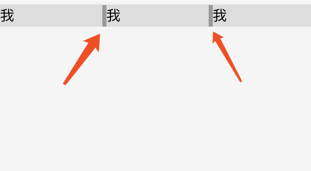

# display: inline-block间隙问题

我们创建一个导航列表，并将其列表 item 设置为 inline-block，主要代码如下：

```html
<div class="nav">
  <div class="nav-item"><a>我</a></div>
  <div class="nav-item"><a>我</a></div>
  <div class="nav-item"><a>我</a></div>
</div>
<style>
.nav {
  background: #999;
}
.nav-item{
  display:inline-block; /* 设置为inline-block */
  width: 100px;
  background: #ddd;
}
</style>
```

效果图如下：



我们从效果图中可以看到列表 item 之间有一点小空隙，但是我们在代码中并没有设置 margin 水平间距。那么这个空隙是如何产生的呢？

这是因为我们编写代码时输入空格、换行都会产生空白符。而浏览器是不会忽略空白符的，且对于多个连续的空白符浏览器会自动将其合并成一个，故产生了所谓的间隙。

对于上面实例，我们在列表 item 元素之间输入了回车换行以方便阅读，而这间隙正是这个回车换行产生的空白符。

同样对于所有的行内元素（inline，inline-block），换行都会产生空白符的间隙。

### 如何消除空白符

从上面我们了解到空白符，是浏览器正常的表现行为。但是对于某些场景来说，并不美观，而且间隙大小非可控，所以我们往往需要去掉这个空白间隙。一般来说我们有两种方法来去掉这个换行引起间隙：代码不换行和设置 font-size。

##### 代码不换行

我们了解到，由于换行空格导致产生换行符，因此我们可以将上述例子中的列表 item 写成一行，这样空白符便消失，间隙就不复存在了。其代码如下：

```html
<div class="nav">
  <div class="nav-item">导航1</div><div class="nav-item">导航2</div><div class="nav-item">导航3</div>
</div>
```

但考虑到代码可读及维护性，我们一般不建议连成一行的写法。

##### 设置 font-size

首先要理解空白符归根结底是个字符，因此，我们可以通过设置 font-size 属性来控制产生的间隙的大小。我们知道如果将 font-size 设置为 0，文字字符是没法显示的，那么同样这个空白字也没了，间隙也就没了。

于是顺着这个思路就有了另一个解决方案：通过设置父元素的 font-size 为 0 来去掉这个间隙，然后重置子元素的 font-size，让其恢复子元素文字字符。

所以该方法CSS代码如下：

```css
.nav {
  background: #999;
  font-size: 0; /* 空白字符大小为0 */
}
.nav-item{
  display:inline-block;
  width: 100px;
  font-size: 16px; /* 重置 font-size 为16px*/
  background: #ddd;
}
```

使用该方法时需要特别注意其子元素一定要重置 font-size，不然很容易掉进坑里（文字显示不出来）。

原文：https://segmentfault.com/a/1190000017668779